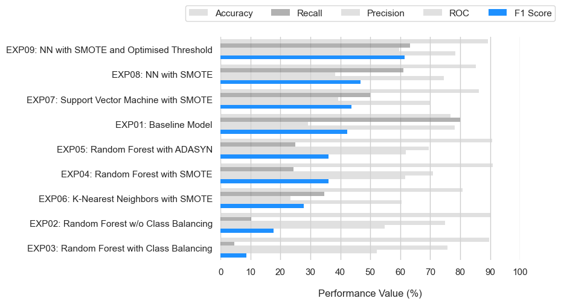

# Detecting Dyslexia Using Deep Learning

Author: Kostadin Dimanov Georgiev

Supervisor: Dr. Ihsan Ullah

 
This repository contains the code for baseline model replication along with all experiments and used datasets as part of the master's thesis on the topic "Detecting Dyslexia Using Deep Learning". In partial fulfillment of the requirements for the degree of MSc in Computer Science - Artificial Intelligence, School of Computer Science, University of Galway.

## Abstract

Dyslexia is a neurodevelopmental disorder affecting reading and language skills. It poses significant challenges for individuals and society. Accurate and early detection of dyslexia is crucial for effective intervention and support. This thesis is based on an existing study with a supplementary dataset of native Spanish-speaking participants. The base paper uses the Random Forest algorithm for the classification of dyslexic and control participants. The reported results are considered a benchmark for the experiments that are part of this study. One of the aims is to improve pre-processing techniques using methods such as Synthetic Minority Oversampling Technique (SMOTE) and Adaptive Synthetic (ADASYN). Additionally, classic machine learning (ML) algorithms and deep neural networks (DNNs) are explored. We propose a new fully-connected Neural Network model which achieved 89.3% Accuracy and 61.4% F1-Score. That is a 12.5% improvement in Accuracy and 19% improvement in F1-Score compared to the baseline model.

**Keywords:**   Dyslexia, Phonology, Online Gamified Test, Synthetic Minority Oversampling Technique, Adaptive Synthetic, Machine Learning, Deep Learning

## Results

### Comparison of results from the experiments

| Model | Acc | Rec | Prec | ROC | F1-Score | T |
| ----- | --- | --- | ---- | --- | -------- | - |
| Base Paper | 79.8 | 80.6 | 79.3 | 0.873 | 79.9 | 0.240 |
| Baseline Model | 76.8 | 80.0 | 29.1 | 0.782 | 42.4 | 0.115 |
| Random Forest w/o Class Balancing | 90.0 | 10.2 | 75.0 | 0.549 | 17.7 | 0.500 |
| Random Forest with Class Balancing | 89.6 | 4.6 | 75.8 | 0.522 | 8.6 | 0.500 |
| Random Forest with SMOTE | 90.8 | 24.4 | 70.9 | 0.616 | 36.0 | 0.500 |
| Random Forest with ADASYN | 90.7 | 25.0 | 69.5 | 0.618 | 36.1 | 0.500 |
| KNN with SMOTE | 80.8 | 34.7 | 23.4 | 0.605 | 27.7 | 0.500 |
| SVM RBF with SMOTE | 86.2 | 49.9 | 39.2 | 0.702 | 43.8 | 0.500 |
| NN with SMOTE | 85.2 | 61.0 | 38.2 | 0.745 | 46.7 | 0.500 |
| **NN with SMOTE and Optimised T** | **89.3** | **63.3** | **59.6** | **0.783** | **61.4** | **0.605** |

 

### Ranking of models performance sorted by F1-Score in decreasing order

## Conclusion

In conclusion, our study embarked on a thorough exploration of predictive models for dyslexia detection, aiming to answer critical research questions while advancing the understanding of effective methodologies. We encountered certain limitations due to the constraints of available computational resources and time.
The inability to delve into the analysis of individual age and gender subsets, as well as the secondary tablet dataset, remains a significant constraint. Similarly,
the extensive computational demands of parameter tuning restricted the number of configurations we could explore, emphasizing the need for a more robust computational infrastructure to support a more comprehensive model exploration.

Despite these limitations, our findings provide a valuable contribution to the field. We were unable to replicate the reported results in the base paper, achieving
slightly lower results for some of the metrics across Accuracy, Recall, Precision, and F1-Score. Our experiments, however, unveiled a notable leap in performance through the implementation of advanced oversampling techniques such as SMOTE and ADASYN. Both techniques yielded an improvement of more than 18% in F1-Score when compared to the simple class weight association. Furthermore, the comparison with classic ML algorithms highlighted the superiority of the Support Vector Machine with an RBF kernel over K-Nearest Neighbours and the initially proposed Random Forest algorithm.

The pinnacle of our exploration was the development of a novel fully-connected neural network model. After tuning, the final model featured a shallow architecture
with a single hidden layer and just two neurons, using the Adam optimizer, which led to a remarkable leap in performance. This model outperformed the baseline by 19% in F1-Score (achieving 61.4%) and an Accuracy increase of 12.5% (achieving 89.3%), thus offering a robust foundation for future dyslexia detection
research.

Looking ahead, there are several avenues for further research. One such direction could be the intriguing application of Explainable Artificial Intelligence (xAI). AI systems are gaining increasing popularity and are sometimes responsible for critical tasks, but the complexity of their inner workings is obfuscated from a human perspective. However, in some situations, such as this study, it might be really important for individuals to be able to comprehend the machine’s ”decision-making process”, where delicate decisions are to be made (making a diagnosis).
